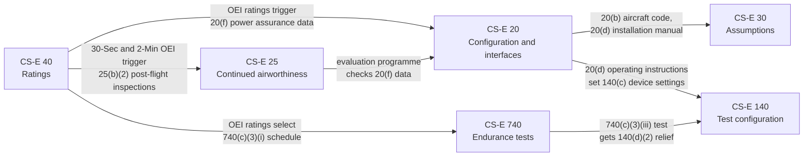

# Talk script — five core CS-E paragraphs

Speaker notes for a short team introduction. Display the vault notes in
Obsidian; read or adapt the text below. About 15 to 20 minutes in total.

All content is taken from the vault notes. Paragraph references are kept so
anyone can check a statement against the note on screen.

## Running order

The order below follows the logic of a certification programme, not the
paragraph numbers. Each paragraph builds on the one before it.

| # | Open in Obsidian | Topic | Time |
|---|---|---|---|
| 0 | this script, diagram below | Why these five | 2 min |
| 1 | `CS-E 20` | What the engine is, and what we hand over | 3 min |
| 2 | `CS-E 30` | What we assume about the aircraft | 2 min |
| 3 | `CS-E 40` | What the engine is rated to deliver | 4 min |
| 4 | `CS-E 25` | How the engine stays airworthy in service | 3 min |
| 5 | `CS-E 140` | How the engine is configured for testing | 3 min |
| 6 | this script, diagram below | Wrap-up | 2 min |

## How they relate

| Paragraph | Receives from | Feeds into |
|---|---|---|
| CS-E 20 | CS-E 40 (OEI ratings make 20(f) mandatory), CS-E 25 (evaluation programme checks 20(f) data) | CS-E 30 (aircraft code, installation manual), CS-E 140 (operating instructions) |
| CS-E 30 | CS-E 20 (20(b) code, 20(d) manual that carries the assumptions) | Instructions for installation |
| CS-E 40 | Engine profile (declared ratings) | CS-E 20(f), CS-E 25(b)(2), CS-E 740 schedule |
| CS-E 25 | CS-E 40 (30-Second and 2-Minute OEI), CS-E 515 (critical parts) | Airworthiness limitations section |
| CS-E 140 | CS-E 20(d), CS-E 740(c)(3)(iii), CS-E 730 | Every certification test |

---

## 0. Opening — why these five

> Today I will introduce five paragraphs of CS-E, Amendment 8. CS-E is the
> EASA certification specification for engines. A **CS-E** paragraph states a
> requirement. An **AMC** paragraph states an Acceptable Means of Compliance:
> one way EASA accepts to show it.
>
> These five are all in Subpart A, the general part. They apply before any
> specific design or test paragraph. They answer five questions:
>
> 1. What exactly are we certifying? — CS-E 20.
> 2. What do we assume about the aircraft? — CS-E 30.
> 3. What does the engine promise to deliver? — CS-E 40.
> 4. How does it stay airworthy after delivery? — CS-E 25.
> 5. What must the engine look like on the test bed? — CS-E 140.
>
> One idea connects them: **the ratings we declare in CS-E 40 create work in
> the other four.** Keep that in mind as we go.

---

## 1. CS-E 20 — Engine Configuration and Interfaces

**Show:** the `CS-E 20` note, then scroll to the Requirement table.

> CS-E 20 draws the boundary of the type certificate. Inside the boundary is the
> list of parts and drawings that defines the engine [CS-E 20(a)]. On the
> boundary are the parts that sit on the engine or are driven by it, but belong
> to the aircraft. We must list those too [CS-E 20(c)].
>
> Then it says what we give the installer. Three things:
>
> - Installation and operating manuals. They define the physical and functional
>   interfaces. For our FADEC they must describe the Primary Mode, every
>   Alternate Mode and any Back-up System, with limitations [CS-E 20(d)].
> - A performance data pack. It must allow a "minimum" and a "maximum" engine
>   to be derived. It must show the effect of bleed, power off-take, forward
>   speed, ambient pressure, temperature and humidity [CS-E 20(e)].
> - Power assurance data. This one exists only because we have OEI ratings
>   [CS-E 20(f)].
>
> Sub-point (f) is our first example of the key idea. We declared OEI ratings in
> CS-E 40, so the power assurance data set is mandatory here.

**Point to:** row **(f)**, strength "Required if claimed".

---

## 2. CS-E 30 — Assumptions

**Show:** the `CS-E 30` note.

> The engine is certified without a specific aircraft. So certification rests on
> assumptions about the installation. CS-E 30 makes those assumptions explicit.
>
> We must submit them before engine certification. We must also write them into
> the instructions for installation — the same manuals CS-E 20(d) requires
> [CS-E 30(a)]. The installer then checks them against the real aircraft.
>
> Sub-point (b) matters for a full-authority FADEC. The control system may depend
> on aircraft components: electrical power, air data, recorded OEI data. Those
> components are outside our type design. Their interface conditions and
> reliability specifications must still be specified [CS-E 30(b)].

**Point to:** the `[VERIFY]` in Application to this engine.

> One item is open. We have not yet confirmed whether the target aircraft is
> certified to CS-27 or CS-29. CS-E itself does not settle it, and the two codes
> ask for different engine data.

**Link to CS-E 20:** the aircraft code is identified under CS-E 20(b); the
assumptions travel in the CS-E 20(d) manuals.

---

## 3. CS-E 40 — Ratings

**Show:** the `CS-E 40` note. This is the central slide; spend the most time
here.

> Every engine must have two ratings: Take-off Power and Maximum Continuous Power
> [CS-E 40(a)]. Everything else is optional. But once we claim a rating, we must
> substantiate it. The vault labels that "Required if claimed".
>
> Our engine declares:
>
> - 30-Second OEI Power, 2-Minute OEI Power and Continuous OEI Power
>   [CS-E 40(b)(3)];
> - Rated 30-Minute Power [CS-E 40(b)(4)].
>
> We do not claim 2½-Minute OEI or 30-Minute OEI.
>
> Two rules deserve attention.
>
> First, sub-point (f). A rating is defined for the lowest power that all engines
> of the type may be expected to produce. It is the weakest production engine,
> not the test engine [CS-E 40(f)].
>
> Second, sub-point (g). The accuracy limits of the control system and the
> instrumentation must be accounted for [CS-E 40(g)].
>
> The rated powers and the crew limitations go into the type certificate data
> sheet [CS-E 40(e)].

**Point to:** Application to this engine.

> Now the key idea. These rating choices drive other paragraphs:
>
> - They make the CS-E 20(f) power assurance data mandatory.
> - They make the CS-E 25(b)(2) post-flight inspections mandatory.
> - They select the endurance test schedule of CS-E 740(c)(3)(i), plus the
>   additional test of CS-E 740(c)(3)(iii).
>
> One clarification. "OEI override" is a control-system feature, not a rating.
> It is assessed under CS-E 50, not here.

---

## 4. CS-E 25 — Instructions for Continued Airworthiness

**Show:** the `CS-E 25` note.

> CS-E 25 requires the Instructions for Continued Airworthiness, the ICA. These
> are the maintenance manuals, and we must keep them updated [CS-E 25(a)].
>
> Inside them there must be an airworthiness limitations section. It must be
> segregated and clearly distinguishable from the rest [CS-E 25(b)]. It carries
> every mandatory replacement time, inspection interval and related procedure
> [CS-E 25(b)(1)]. For critical parts it also carries the mandatory actions from
> the Service Management Plan of CS-E 515.

**Point to:** row **(b)(2)**.

> Here is the operational cost of our OEI ratings. Because we have 30-Second and
> 2-Minute OEI, any use of either rating triggers mandatory post-flight
> inspections and maintenance actions. We must validate that those actions are
> adequate. We must also run an in-service engine evaluation programme
> [CS-E 25(b)(2)].
>
> That programme closes a loop with CS-E 20: it confirms the power assurance
> data of CS-E 20(f) in service.
>
> Sub-point (c) lists thirteen items for the manuals. The duty there is to
> **consider** each item, "as appropriate" [CS-E 25(c)]. Item (c)(13), security
> instructions, applies to us because we have a full-authority EECS.

---

## 5. CS-E 140 — Tests - Engine Configuration

**Show:** the `CS-E 140` note.

> CS-E 140 fixes what the engine must look like when we test it. It applies to
> every certification test.
>
> - The test configuration must be sufficiently representative of the type
>   design [CS-E 140(a)].
> - All automatic controls and protections must be in operation. For us, that
>   means the FADEC protections. Running with a protection inhibited needs
>   acceptance; we cannot decide it alone [CS-E 140(b)].
> - Variable devices are set to the type design, and operated consistently with
>   the CS-E 20(d) operating instructions [CS-E 140(c)].
> - Accessory drives are off-loaded for the calibration test of CS-E 730, and
>   loaded for all other tests [CS-E 140(d)(1)].

**Point to:** the two **(d)(2)** rows.

> Sub-point (d)(2) connects back to our ratings. The additional endurance test of
> CS-E 740(c)(3)(iii) exists because we have 30-Second and 2-Minute OEI. For that
> test, the accessory drives need not be loaded — if we substantiate no
> significant effect on durability. But the load does not disappear. The
> equivalent power extraction is added to the engine shaft output
> [CS-E 140(d)(2)]. The power turbine still does the work.
>
> Sub-point (e) covers features the aircraft supplies rather than the engine. If
> engine performance depends on them, the tests must represent them
> [CS-E 140(e)].

---

## 6. Wrap-up

**Show:** the diagram at the top of this script, or the Obsidian graph view
filtered to these five notes.

> To summarise:
>
> - **CS-E 20** defines the engine and what we hand to the installer.
> - **CS-E 30** makes our assumptions about the aircraft explicit.
> - **CS-E 40** declares what the engine delivers.
> - **CS-E 25** keeps it airworthy in service.
> - **CS-E 140** fixes how it is configured for testing.
>
> And the thread through all of them: **our OEI ratings.** Declaring 30-Second
> and 2-Minute OEI in CS-E 40 creates power assurance data in CS-E 20, a
> post-flight inspection regime in CS-E 25, and an extra endurance test that
> CS-E 140 treats specially.
>
> Every rating we claim has a cost somewhere else in the code. That is why the
> rating choice is made early, and made carefully.

## Likely questions

| Question | Short answer | Where |
|---|---|---|
| Why not claim 2½-Minute OEI too? | Not declared in `engine_profile.md`. Not claiming it removes the 2½-minute insertions from the endurance schedule. | `CS-E 40`, `CS-E 740` |
| Is "OEI override" a rating? | No. It is a control-system feature, assessed under CS-E 50. | `CS-E 40` |
| CS-27 or CS-29? | Open item. CS-E does not settle it. | `CS-E 30` |
| Are the (c) items in CS-E 25 mandatory? | Considering them is required; inclusion is "as appropriate". | `CS-E 25` |
| What does "Required if claimed" mean? | Optional to claim; mandatory to substantiate once claimed. | `CLAUDE.md`, Obligation strength |
