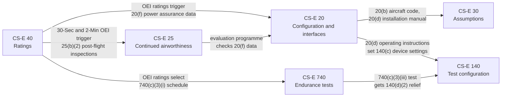
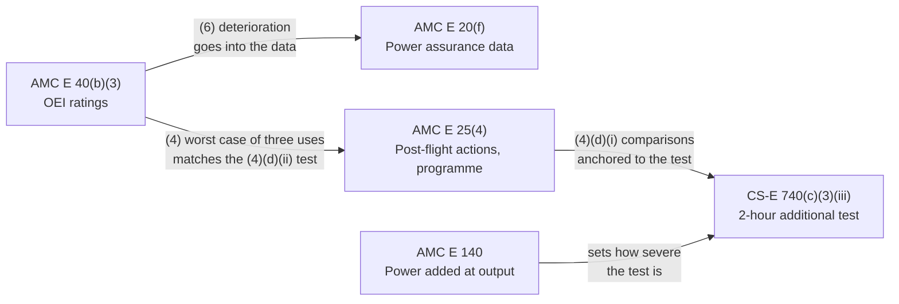

# Talk script — five core CS-E paragraphs and their AMC

Speaker notes for a short team introduction. Display the vault notes in
Obsidian; read or adapt the text below. About 25 to 30 minutes in total.

All content is taken from the vault notes. Paragraph references are kept so
anyone can check a statement against the note on screen.

## Running order

The order below follows the logic of a certification programme, not the
paragraph numbers. Each paragraph builds on the one before it.

| # | Open in Obsidian | Topic | Time |
|---|---|---|---|
| 0 | this script, diagrams below | Why these five | 2 min |
| 1 | `CS-E 20`, then `AMC E 20` | What the engine is, and what we hand over | 5 min |
| 2 | `CS-E 30`, then `AMC E 30` | What we assume about the aircraft | 3 min |
| 3 | `CS-E 40`, then `AMC E 40` | What the engine is rated to deliver | 7 min |
| 4 | `CS-E 25`, then `AMC E 25` | How the engine stays airworthy in service | 5 min |
| 5 | `CS-E 140`, then `AMC E 140` | How the engine is configured for testing | 4 min |
| 6 | this script, diagrams below | Wrap-up | 2 min |

## How they relate

| Paragraph | Receives from | Feeds into |
|---|---|---|
| CS-E 20 | CS-E 40 (OEI ratings make 20(f) mandatory), CS-E 25 (evaluation programme checks 20(f) data) | CS-E 30 (aircraft code, installation manual), CS-E 140 (operating instructions) |
| CS-E 30 | CS-E 20 (20(b) code, 20(d) manual that carries the assumptions) | Instructions for installation |
| CS-E 40 | Engine profile (declared ratings) | CS-E 20(f), CS-E 25(b)(2), CS-E 740 schedule |
| CS-E 25 | CS-E 40 (30-Second and 2-Minute OEI), CS-E 515 (critical parts) | Airworthiness limitations section |
| CS-E 140 | CS-E 20(d), CS-E 740(c)(3)(iii), CS-E 730 | Every certification test |

Each section opens the CS-E note first and its AMC note second.

| Specification | AMC note | What the AMC adds |
|---|---|---|
| CS-E 20 | `AMC E 20` (carries AMC E 20 and AMC E 20(f)) | The EECS content of the installation manual; the content of the power assurance data |
| CS-E 30 | `AMC E 30` | Table 1, the minimum list of assumptions |
| CS-E 40 | `AMC E 40` (carries AMC E 40, AMC E 40(b)(3) and AMC E 40(d)) | How a rating is justified; what the OEI ratings are for; the operating limitations to declare |
| CS-E 25 | `AMC E 25` | Post-flight actions after OEI use; their validation; the in-service evaluation programme |
| CS-E 140 | `AMC E 140` | The acceptance criterion for the power added when the drives are unloaded |

The AMC notes also link to each other, and to the test the OEI ratings select:

---

## 0. Opening — why these five

> Today I will introduce five paragraphs of CS-E, Amendment 8, and the AMC for
> each. CS-E is the EASA certification specification for engines. A **CS-E**
> paragraph states a requirement. An **AMC** paragraph states an Acceptable
> Means of Compliance: one way EASA accepts to show it.
>
> For each paragraph I will show the CS-E note first, then its AMC note. In an
> AMC note most rows read **Accepted method**. That is one accepted way to
> comply. We may propose another way, but we must justify it.
>
> These five are all in Subpart A, the general part. They apply before any
> specific design or test paragraph. They answer five questions:
>
> 1. What exactly are we certifying? — CS-E 20.
> 2. What do we assume about the aircraft? — CS-E 30.
> 3. What does the engine promise to deliver? — CS-E 40.
> 4. How does it stay airworthy after delivery? — CS-E 25.
> 5. What must the engine look like on the test bed? — CS-E 140.
>
> One idea connects them: **the ratings we declare in CS-E 40 create work in
> the other four.** Keep that in mind as we go.

---

## 1. CS-E 20 — Engine Configuration and Interfaces

**Show:** the `CS-E 20` note, then scroll to the Requirement table.

> CS-E 20 draws the boundary of the type certificate. Inside the boundary is the
> list of parts and drawings that defines the engine [CS-E 20(a)]. On the
> boundary are the parts that sit on the engine or are driven by it, but belong
> to the aircraft. We must list those too [CS-E 20(c)].
>
> Then it says what we give the installer. Three things:
>
> - Installation and operating manuals. They define the physical and functional
>   interfaces. For our FADEC they must describe the Primary Mode, every
>   Alternate Mode and any Back-up System, with limitations [CS-E 20(d)].
> - A performance data pack. It must allow a "minimum" and a "maximum" engine
>   to be derived. It must show the effect of bleed, power off-take, forward
>   speed, ambient pressure, temperature and humidity [CS-E 20(e)].
> - Power assurance data. This one exists only because we have OEI ratings
>   [CS-E 20(f)].
>
> Sub-point (f) is our first example of the key idea. We declared OEI ratings in
> CS-E 40, so the power assurance data set is mandatory here.

**Point to:** row **(f)**, strength "Required if claimed".

### AMC E 20 — how to meet it

**Show:** the `AMC E 20` note. It carries two AMC paragraphs: the general
AMC E 20 and AMC E 20(f).

> The general AMC says what goes into the type design list: the items necessary
> for the engine to function and to be controlled [AMC E 20(1)]. Items that only
> supply non-mechanical inputs, such as voltage, current or fuel, need not be
> listed if those inputs can be clearly specified [AMC E 20(2)].
>
> For our FADEC, the installation manual should describe every operational mode
> and its interface with the aircraft. That includes Back-up and Alternate
> Modes, whether dispatchable or not [AMC E 20(7)].
>
> Point (6) gives one example of an aircraft-supplied resource: recording of
> rotorcraft OEI data. If our EECS depends on such a resource, we are
> responsible for specifying it and substantiating it [AMC E 20(6)].

**Point to:** the `[VERIFY]` in Application to this engine.

> It is not yet confirmed whether our EECS depends on the aircraft for OEI usage
> recording. That is an open item.

**Scroll to:** AMC E 20(f).

> AMC E 20(f) is the heavier part. It says what the power assurance data should
> contain. Five points:
>
> - Data that lets the installer meet the power availability rules of the
>   rotorcraft code, with installation losses up to the highest power rating
>   [AMC E 20(f)(1)].
> - Dormant Failures that could make an OEI rating unavailable, taken from the
>   CS-E 510 safety analysis [AMC E 20(f)(2)].
> - Maintenance procedures that detect latent conditions a normal power check
>   does not find. The AMC names fuel control maximum flow capability and
>   turbine section distress [AMC E 20(f)(3)].
> - A way to extrapolate from a lower power check level up to the highest OEI
>   rating power [AMC E 20(f)(4)].
> - Information showing that limiter settings do not stop the engine reaching
>   30-Second or 2-Minute OEI power. Speed, gas temperature and fuel flow
>   limiters are named. Take-off with a cold-soaked engine needs particular
>   attention [AMC E 20(f)(5)].
>
> One point on the aircraft code. CS-27 and CS-29 ask the same thing here: a
> means for the pilot to determine, before take-off, that each engine can
> develop the power needed [ext CS 27.45(f)], [ext CS 29.45(f)]. So the open
> CS-27 or CS-29 question does not change this data.

---

## 2. CS-E 30 — Assumptions

**Show:** the `CS-E 30` note.

> The engine is certified without a specific aircraft. So certification rests on
> assumptions about the installation. CS-E 30 makes those assumptions explicit.
>
> We must submit them before engine certification. We must also write them into
> the instructions for installation — the same manuals CS-E 20(d) requires
> [CS-E 30(a)]. The installer then checks them against the real aircraft.
>
> Sub-point (b) matters for a full-authority FADEC. The control system may depend
> on aircraft components: electrical power, air data, recorded OEI data. Those
> components are outside our type design. Their interface conditions and
> reliability specifications must still be specified [CS-E 30(b)].

**Point to:** the `[VERIFY]` in Application to this engine.

> One item is open. We have not yet confirmed whether the target aircraft is
> certified to CS-27 or CS-29. CS-E itself does not settle it, and the two codes
> ask for different engine data.

**Link to CS-E 20:** the aircraft code is identified under CS-E 20(b); the
assumptions travel in the CS-E 20(d) manuals.

### AMC E 30 — the checklist

**Show:** the `AMC E 30` note, then the three embedded Table 1 pages.

> AMC E 30 is one sentence and one table. The assumptions should normally cover
> at least the items of Table 1 [AMC E 30]. Each row pairs an assumption with
> the CS-E paragraph that needs it, so an installer can trace every assumption
> back to its source.
>
> For us, these rows matter most [AMC E 30]:
>
> - Interfaces, including mount flexibility, attitudes and loads — CS-E 20.
> - Engine Control System interface conditions — CS-E 50.
> - For 30-Second and 2-Minute OEI, the conditions on the usage recording system
>   — CS-E 60.
>
> Amendment 7 added one item to the Oil system row: the engine's maximum
> allowable oil consumption. It lets the installer meet the aircraft oil system
> rules. That is new work, and it links to CS-E 570 [AMC E 30].

---

## 3. CS-E 40 — Ratings

**Show:** the `CS-E 40` note. This is the central slide; spend the most time
here.

> Every engine must have two ratings: Take-off Power and Maximum Continuous Power
> [CS-E 40(a)]. Everything else is optional. But once we claim a rating, we must
> substantiate it. The vault labels that "Required if claimed".
>
> Our engine declares:
>
> - 30-Second OEI Power, 2-Minute OEI Power and Continuous OEI Power
>   [CS-E 40(b)(3)];
> - Rated 30-Minute Power [CS-E 40(b)(4)].
>
> We do not claim 2½-Minute OEI or 30-Minute OEI.
>
> Two rules deserve attention.
>
> First, sub-point (f). A rating is defined for the lowest power that all engines
> of the type may be expected to produce. It is the weakest production engine,
> not the test engine [CS-E 40(f)].
>
> Second, sub-point (g). The accuracy limits of the control system and the
> instrumentation must be accounted for [CS-E 40(g)].
>
> The rated powers and the crew limitations go into the type certificate data
> sheet [CS-E 40(e)].

**Point to:** Application to this engine.

> Now the key idea. These rating choices drive other paragraphs:
>
> - They make the CS-E 20(f) power assurance data mandatory.
> - They make the CS-E 25(b)(2) post-flight inspections mandatory.
> - They select the endurance test schedule of CS-E 740(c)(3)(i), plus the
>   additional test of CS-E 740(c)(3)(iii).
>
> One clarification. "OEI override" is a control-system feature, not a rating.
> It is assessed under CS-E 50, not here.

### AMC E 40 — what the ratings mean

**Show:** the `AMC E 40` note. It carries three AMC paragraphs: AMC E 40,
AMC E 40(b)(3) and AMC E 40(d).

> First, a rating is not established by declaration alone. It is justified with
> the calibration test of CS-E 730 and the endurance test of CS-E 740, or by
> other means [AMC E 40].

**Scroll to:** AMC E 40(b)(3).

> This part explains our OEI ratings.
>
> - 30-Second and 2-Minute OEI are two separate ratings, in a combined structure
>   of 2.5 minutes [AMC E 40(b)(3)(1)].
> - 30-Second OEI gives a short burst of power after an engine Failure at the
>   critical decision point. The rotorcraft completes the take-off and climbs
>   out, or rejects the take-off. It also gives power for a safe or baulked
>   landing. 2-Minute OEI then completes the climb to safe altitude and airspeed
>   [AMC E 40(b)(3)(2)].
> - The ratings are intended for one use per flight. The certification
>   specifications are nevertheless built around a worst case of three uses in
>   one flight [AMC E 40(b)(3)(4)].
> - The ratings should account for the deterioration seen in the 2-hour
>   additional endurance test, up to and including the third 30-Second OEI
>   application. Where deterioration at the 30-Second OEI rating exceeds 10 %
>   over that test, its mode should be evaluated [AMC E 40(b)(3)(6)].
> - Rated 30-Minute Power may be set at any level from Maximum Continuous up to
>   and including take-off. It may be used for several periods of up to 30
>   minutes each [AMC E 40(b)(3)(7)].

**Scroll to:** AMC E 40(d).

> The last part lists the operating limitations to declare. The source lists
> twenty-one turbine engine items; eighteen reach a turboshaft [AMC E 40(d)(3)].
> Two are primary for us: power turbine speed for autorotation, and power
> turbine torque [AMC E 40(d)(3)(n)], [AMC E 40(d)(3)(o)].

**Point to:** the `[VERIFY]` on item (a).

> Item (a) uses "Contingency" rating names. CS-E 40 does not use those names.
> The mapping to our OEI ratings must be confirmed with the Agency before it
> enters the TCDS.

---

## 4. CS-E 25 — Instructions for Continued Airworthiness

**Show:** the `CS-E 25` note.

> CS-E 25 requires the Instructions for Continued Airworthiness, the ICA. These
> are the maintenance manuals, and we must keep them updated [CS-E 25(a)].
>
> Inside them there must be an airworthiness limitations section. It must be
> segregated and clearly distinguishable from the rest [CS-E 25(b)]. It carries
> every mandatory replacement time, inspection interval and related procedure
> [CS-E 25(b)(1)]. For critical parts it also carries the mandatory actions from
> the Service Management Plan of CS-E 515.

**Point to:** row **(b)(2)**.

> Here is the operational cost of our OEI ratings. Because we have 30-Second and
> 2-Minute OEI, any use of either rating triggers mandatory post-flight
> inspections and maintenance actions. We must validate that those actions are
> adequate. We must also run an in-service engine evaluation programme
> [CS-E 25(b)(2)].
>
> That programme closes a loop with CS-E 20: it confirms the power assurance
> data of CS-E 20(f) in service.
>
> Sub-point (c) lists thirteen items for the manuals. The duty there is to
> **consider** each item, "as appropriate" [CS-E 25(c)]. Item (c)(13), security
> instructions, applies to us because we have a full-authority EECS.

### AMC E 25 — the OEI maintenance regime

**Show:** the `AMC E 25` note. It is the heaviest AMC in Subpart A.

> Most of this AMC is about our two short OEI ratings.
>
> - The airworthiness limitations section must prescribe the post-flight
>   inspections and maintenance actions after any use of either rating, before
>   the next flight [AMC E 25(4)(a)]. This row reads Required, because the
>   source says that section is "required to prescribe" them.
> - Where only the accumulated usage time is recorded, the action should be
>   based on the total recorded duration. The number of applications in the
>   flight does not matter [AMC E 25(4)(a)].
> - Where no maintenance action results, the minimum is to interpret the
>   recorded event data and document it in the maintenance log [AMC E 25(4)(b)].
> - We should provide evidence that both OEI powers are achievable and
>   sustainable at any time between overhauls [AMC E 25(4)(c)(i)].

**Point to:** the in-service evaluation programme, (4)(d).

> Under this accepted means, the Agency approves the in-service evaluation
> programme **before certification** [AMC E 25(4)(d)(i)]. It is not work we can
> defer.
>
> The programme compares in-service data with the 2-hour additional endurance
> test. Engines that never used the ratings are compared with the parameters
> before that test. Engines that used them are compared with the parameters
> after it [AMC E 25(4)(d)(i)]. One programme element is a test with three
> applications of 30 seconds OEI rated power. That matches the worst case of
> three uses in AMC E 40 [AMC E 25(4)(d)(ii)].
>
> Two smaller points. For Rated 30-Minute Power, usage limits such as a
> cumulated time limit should be specified in the ICA, with instructions for
> when they are reached [AMC E 25(5)]. And Amendment 8 added the initial
> maintenance programme test of CS-E 930 to the tests that determine maintenance
> actions [AMC E 25(1)].

---

## 5. CS-E 140 — Tests - Engine Configuration

**Show:** the `CS-E 140` note.

> CS-E 140 fixes what the engine must look like when we test it. It applies to
> every certification test.
>
> - The test configuration must be sufficiently representative of the type
>   design [CS-E 140(a)].
> - All automatic controls and protections must be in operation. For us, that
>   means the FADEC protections. Running with a protection inhibited needs
>   acceptance; we cannot decide it alone [CS-E 140(b)].
> - Variable devices are set to the type design, and operated consistently with
>   the CS-E 20(d) operating instructions [CS-E 140(c)].
> - Accessory drives are off-loaded for the calibration test of CS-E 730, and
>   loaded for all other tests [CS-E 140(d)(1)].

**Point to:** the two **(d)(2)** rows.

> Sub-point (d)(2) connects back to our ratings. The additional endurance test of
> CS-E 740(c)(3)(iii) exists because we have 30-Second and 2-Minute OEI. For that
> test, the accessory drives need not be loaded — if we substantiate no
> significant effect on durability. But the load does not disappear. The
> equivalent power extraction is added to the engine shaft output
> [CS-E 140(d)(2)]. The power turbine still does the work.
>
> Sub-point (e) covers features the aircraft supplies rather than the engine. If
> engine performance depends on them, the tests must represent them
> [CS-E 140(e)].

### AMC E 140 — the acceptance criterion

**Show:** the `AMC E 140` note.

> CS-E 140(d)(2) says the equivalent power is added to the shaft output. It does
> not say what that addition must achieve. AMC E 140 says it in one sentence.
> The power turbine rotor assembly is operated "at or above the same level as it
> would be if the power turbine accessory drives were loaded" [AMC E 140].
>
> So the unloaded test is never less severe on the power turbine than the loaded
> one. For us, this matters in the CS-E 740(c)(3)(iii) test.

---

## 6. Wrap-up

**Show:** the diagrams at the top of this script, or the Obsidian graph view
filtered to these ten notes.

> To summarise:
>
> - **CS-E 20** defines the engine and what we hand to the installer.
> - **CS-E 30** makes our assumptions about the aircraft explicit.
> - **CS-E 40** declares what the engine delivers.
> - **CS-E 25** keeps it airworthy in service.
> - **CS-E 140** fixes how it is configured for testing.
>
> The AMC notes show how. AMC E 20(f) fixes the content of the power assurance
> data. AMC E 30 gives the Table 1 checklist. AMC E 40(b)(3) explains the OEI
> ratings. AMC E 25 sets the maintenance regime and the in-service programme.
> AMC E 140 sets the criterion for the power turbine.
>
> And the thread through all of them: **our OEI ratings.** Declaring 30-Second
> and 2-Minute OEI in CS-E 40 creates power assurance data in CS-E 20, a
> post-flight inspection regime in CS-E 25, and an extra endurance test that
> CS-E 140 treats specially.
>
> Every rating we claim has a cost somewhere else in the code. That is why the
> rating choice is made early, and made carefully.

## Likely questions

| Question | Short answer | Where |
|---|---|---|
| Why not claim 2½-Minute OEI too? | Not declared in `engine_profile.md`. Not claiming it removes the 2½-minute insertions from the endurance schedule. | `CS-E 40`, `CS-E 740` |
| Is "OEI override" a rating? | No. It is a control-system feature, assessed under CS-E 50. | `CS-E 40` |
| CS-27 or CS-29? | Open item. CS-E does not settle it. | `CS-E 30` |
| Are the (c) items in CS-E 25 mandatory? | Considering them is required; inclusion is "as appropriate". | `CS-E 25` |
| What does "Required if claimed" mean? | Optional to claim; mandatory to substantiate once claimed. | `CLAUDE.md`, Obligation strength |
| Is an AMC mandatory? | No. It is one accepted way; another may be proposed and justified. A row whose wording is mandatory, such as AMC E 25(4)(a), still reads Required. | `CLAUDE.md`, Obligation strength |
| When must the in-service evaluation programme be ready? | Under AMC E 25, the Agency approves it before certification. | `AMC E 25` |
| Why does CS-27 or CS-29 not change the power assurance data? | Both codes ask for the same pre-take-off power check, at point 45(f). | `AMC E 20` |
| What if deterioration exceeds 10 % in the 2-hour test? | Its mode should be evaluated, so that 30-Second OEI power stays available in service. | `AMC E 40` |
