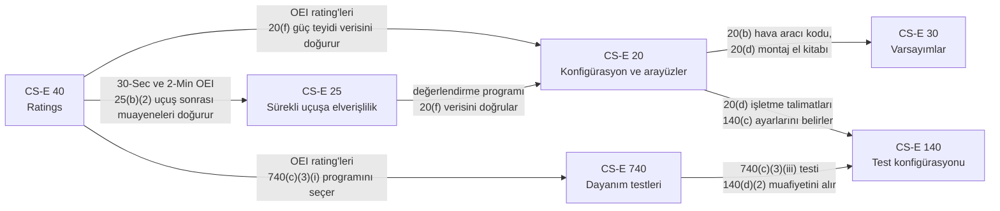

# Konuşma metni — CS-E'nin beş temel paragrafı

Kısa bir ekip tanıtımı için konuşmacı notları. Vault notlarını Obsidian'da
gösterin; aşağıdaki metni okuyun veya uyarlayın. Toplam süre yaklaşık 15-20
dakikadır.

Tüm içerik vault notlarından alınmıştır. Paragraf referansları korunmuştur;
böylece her ifade ekrandaki notla karşılaştırılabilir. Obsidian notları
İngilizcedir. Bu nedenle CS-E terimleri, rating adları ve `Strength` etiketleri
metinde İngilizce bırakılmış, gerektiğinde Türkçe açıklaması verilmiştir.

## Sunum sırası

Sıra, paragraf numaralarına göre değil, bir sertifikasyon programının
mantığına göre kurulmuştur. Her paragraf bir öncekinin üzerine oturur.

| # | Obsidian'da açılacak | Konu | Süre |
|---|---|---|---|
| 0 | bu metin, aşağıdaki diyagram | Neden bu beş paragraf | 2 dk |
| 1 | `CS-E 20` | Motor nedir, kuruluma ne teslim ederiz | 3 dk |
| 2 | `CS-E 30` | Hava aracı hakkında neyi varsayarız | 2 dk |
| 3 | `CS-E 40` | Motor hangi gücü taahhüt eder | 4 dk |
| 4 | `CS-E 25` | Motor hizmette nasıl uçuşa elverişli kalır | 3 dk |
| 5 | `CS-E 140` | Motor test için nasıl konfigüre edilir | 3 dk |
| 6 | bu metin, aşağıdaki diyagram | Kapanış | 2 dk |

## Paragraflar arası ilişki

| Paragraf | Girdi aldığı yer | Çıktı verdiği yer |
|---|---|---|
| CS-E 20 | CS-E 40 (OEI rating'leri 20(f)'yi zorunlu kılar), CS-E 25 (değerlendirme programı 20(f) verisini doğrular) | CS-E 30 (hava aracı kodu, montaj el kitabı), CS-E 140 (işletme talimatları) |
| CS-E 30 | CS-E 20 (20(b) kodu, varsayımları taşıyan 20(d) el kitabı) | Montaj talimatları |
| CS-E 40 | Motor profili (beyan edilen rating'ler) | CS-E 20(f), CS-E 25(b)(2), CS-E 740 test programı |
| CS-E 25 | CS-E 40 (30-Second ve 2-Minute OEI), CS-E 515 (kritik parçalar) | Uçuşa elverişlilik sınırlamaları bölümü |
| CS-E 140 | CS-E 20(d), CS-E 740(c)(3)(iii), CS-E 730 | Tüm sertifikasyon testleri |

---

## 0. Açılış — neden bu beş paragraf

> Bugün CS-E Amendment 8'in beş paragrafını tanıtacağım. CS-E, EASA'nın motorlar
> için sertifikasyon şartnamesidir. Bir **CS-E** paragrafı bir gereklilik
> belirtir. Bir **AMC** paragrafı ise bir Acceptable Means of Compliance, yani
> Kabul Edilebilir Uyum Yöntemi belirtir: EASA'nın kabul ettiği bir uyum
> gösterme yolu.
>
> Bu beş paragrafın hepsi Subpart A'dadır, yani genel bölümdedir. Herhangi bir
> tasarım veya test paragrafından önce uygulanırlar. Beş soruyu yanıtlarlar:
>
> 1. Tam olarak neyi sertifikalandırıyoruz? — CS-E 20.
> 2. Hava aracı hakkında neyi varsayıyoruz? — CS-E 30.
> 3. Motor ne sağlamayı taahhüt ediyor? — CS-E 40.
> 4. Teslimattan sonra uçuşa elverişli nasıl kalıyor? — CS-E 25.
> 5. Test standında motor nasıl görünmeli? — CS-E 140.
>
> Hepsini bağlayan tek bir fikir var: **CS-E 40'ta beyan ettiğimiz rating'ler,
> diğer dört paragrafta iş yükü doğurur.** İlerlerken bunu aklınızda tutun.

---

## 1. CS-E 20 — Engine Configuration and Interfaces (Motor Konfigürasyonu ve Arayüzler)

**Göster:** `CS-E 20` notu, ardından Requirement tablosuna in.

> CS-E 20, tip sertifikasının sınırını çizer. Sınırın içinde motoru tanımlayan
> parça ve resim listesi vardır [CS-E 20(a)]. Sınırın üzerinde ise motora monte
> edilen veya motordan tahrik alan, fakat hava aracına ait olan parçalar
> vardır. Bunları da listelemek zorundayız [CS-E 20(c)].
>
> Ardından kurulumu yapana ne vereceğimizi söyler. Üç şey:
>
> - Montaj ve işletme el kitapları. Fiziksel ve fonksiyonel arayüzleri
>   tanımlarlar. FADEC'imiz için Primary Mode'u, her Alternate Mode'u ve varsa
>   Back-up System'i sınırlamalarıyla birlikte tanımlamalıdırlar [CS-E 20(d)].
> - Bir performans veri paketi. Bu paketten bir "minimum" ve bir "maximum" motor
>   türetilebilmelidir. Bleed (hava çekişi), güç çekişi (power off-take), ileri
>   hız, ortam basıncı, sıcaklık ve nemin etkisini göstermelidir [CS-E 20(e)].
> - Güç teyidi (power assurance) verisi. Bu veri yalnızca OEI rating'lerimiz
>   olduğu için vardır [CS-E 20(f)].
>
> Alt madde (f), ana fikrin ilk örneğidir. CS-E 40'ta OEI rating'leri beyan
> ettik; bu yüzden güç teyidi veri seti burada zorunludur.

**Göster:** **(f)** satırı, strength "Required if claimed" (talep edilirse
zorunlu).

---

## 2. CS-E 30 — Assumptions (Varsayımlar)

**Göster:** `CS-E 30` notu.

> Motor, belirli bir hava aracı olmadan sertifikalandırılır. Bu nedenle
> sertifikasyon, kurulum hakkındaki varsayımlara dayanır. CS-E 30 bu
> varsayımları açık hale getirir.
>
> Varsayımları motor sertifikasyonundan önce sunmak zorundayız. Ayrıca bunları
> montaj talimatlarına yazmak zorundayız; bunlar CS-E 20(d)'nin istediği el
> kitaplarıdır [CS-E 30(a)]. Kurulumu yapan taraf da bunları gerçek hava aracıyla
> karşılaştırır.
>
> Alt madde (b), tam yetkili (full authority) bir FADEC için önemlidir. Kontrol
> sistemi hava aracı bileşenlerine bağımlı olabilir: elektrik gücü, hava verisi,
> kaydedilen OEI verisi. Bu bileşenler bizim tip tasarımımızın dışındadır. Yine
> de arayüz koşulları ve güvenilirlik şartnameleri belirtilmelidir
> [CS-E 30(b)].

**Göster:** Application to this engine bölümündeki `[VERIFY]`.

> Açık bir madde var. Hedef hava aracının CS-27'ye mi yoksa CS-29'a mı göre
> sertifikalandırılacağı henüz teyit edilmedi. CS-E bunu kendisi çözmüyor ve iki
> kod farklı motor verisi istiyor.

**CS-E 20 ile bağlantı:** hava aracı kodu CS-E 20(b) altında belirtilir;
varsayımlar CS-E 20(d) el kitaplarında taşınır.

---

## 3. CS-E 40 — Ratings

**Göster:** `CS-E 40` notu. Bu ana slayttır; en çok zamanı burada harcayın.

> Her motorun iki rating'i olmak zorundadır: Take-off Power (kalkış gücü) ve
> Maximum Continuous Power (azami sürekli güç) [CS-E 40(a)]. Diğer her şey
> isteğe bağlıdır. Ancak bir rating'i talep ettiğimiz anda onu kanıtlamak
> zorundayız. Vault bunu "Required if claimed" olarak etiketler.
>
> Motorumuz şunları beyan eder:
>
> - 30-Second OEI Power, 2-Minute OEI Power ve Continuous OEI Power
>   [CS-E 40(b)(3)];
> - Rated 30-Minute Power [CS-E 40(b)(4)].
>
> 2½-Minute OEI ve 30-Minute OEI talep edilmiyor.
>
> İki kural özellikle önemlidir.
>
> Birincisi, alt madde (f). Bir rating, o tipteki tüm motorların üretmesi
> beklenebilecek en düşük güç için tanımlanır. Yani referans test motoru değil,
> en zayıf üretim motorudur [CS-E 40(f)].
>
> İkincisi, alt madde (g). Kontrol sisteminin ve enstrümantasyonun doğruluk
> sınırları hesaba katılmalıdır [CS-E 40(g)].
>
> Beyan edilen güçler ve mürettebatın uyması gereken sınırlamalar, tip
> sertifikası veri sayfasına (TCDS) girer [CS-E 40(e)].

**Göster:** Application to this engine bölümü.

> Şimdi ana fikir. Bu rating seçimleri diğer paragrafları yönlendirir:
>
> - CS-E 20(f) güç teyidi verisini zorunlu kılar.
> - CS-E 25(b)(2) uçuş sonrası muayenelerini zorunlu kılar.
> - CS-E 740(c)(3)(i) dayanım testi programını ve buna ek olarak
>   CS-E 740(c)(3)(iii) ek testini seçer.
>
> Bir açıklama. "OEI override" bir rating değil, bir kontrol sistemi
> özelliğidir. Burada değil, CS-E 50 altında değerlendirilir.

---

## 4. CS-E 25 — Instructions for Continued Airworthiness (Sürekli Uçuşa Elverişlilik Talimatları)

**Göster:** `CS-E 25` notu.

> CS-E 25, Sürekli Uçuşa Elverişlilik Talimatlarını, yani ICA'yı ister. Bunlar
> bakım el kitaplarıdır ve güncel tutmak zorundayız [CS-E 25(a)].
>
> İçlerinde bir uçuşa elverişlilik sınırlamaları bölümü (airworthiness
> limitations section) bulunmalıdır. Bu bölüm ayrı tutulmalı ve belgenin geri
> kalanından açıkça ayırt edilebilmelidir [CS-E 25(b)]. Her zorunlu değişim
> süresini, muayene aralığını ve ilgili prosedürü içerir [CS-E 25(b)(1)]. Kritik
> parçalar için CS-E 515'teki Servis Yönetim Planı'ndan gelen zorunlu
> işlemleri de taşır.

**Göster:** **(b)(2)** satırı.

> OEI rating'lerimizin operasyonel maliyeti burada ortaya çıkar. 30-Second ve
> 2-Minute OEI rating'lerimiz olduğu için, bunlardan herhangi birinin her
> kullanımı zorunlu uçuş sonrası muayeneleri ve bakım işlemlerini tetikler. Bu
> işlemlerin yeterli olduğunu doğrulamak zorundayız. Ayrıca bir hizmette motor
> değerlendirme programı (in-service engine evaluation programme) yürütmek
> zorundayız [CS-E 25(b)(2)].
>
> Bu program CS-E 20 ile bir döngüyü kapatır: CS-E 20(f)'nin güç teyidi
> verisini hizmette doğrular.
>
> Alt madde (c), el kitapları için on üç kalem listeler. Oradaki yükümlülük her
> kalemi **değerlendirmektir**; dahil etme "as appropriate", yani uygun
> olduğunda yapılır [CS-E 25(c)]. Kalem (c)(13), güvenlik talimatları, tam
> yetkili bir EECS'imiz olduğu için bizim için geçerlidir.

---

## 5. CS-E 140 — Tests - Engine Configuration (Testler - Motor Konfigürasyonu)

**Göster:** `CS-E 140` notu.

> CS-E 140, test sırasında motorun nasıl görünmesi gerektiğini belirler. Tüm
> sertifikasyon testlerine uygulanır.
>
> - Test konfigürasyonu, tip tasarımını yeterince temsil etmelidir
>   [CS-E 140(a)].
> - Tüm otomatik kontroller ve korumalar çalışır durumda olmalıdır. Bizim için
>   bu, FADEC korumaları demektir. Bir koruma devre dışıyken test yapmak kabul
>   gerektirir; bunu tek başımıza kararlaştıramayız [CS-E 140(b)].
> - Değişken elemanlar tip tasarımına göre ayarlanır ve CS-E 20(d) işletme
>   talimatlarıyla tutarlı şekilde çalıştırılır [CS-E 140(c)].
> - Aksesuar tahrikleri CS-E 730 kalibrasyon testi için yüksüz bırakılır, diğer
>   tüm testlerde yüklenir [CS-E 140(d)(1)].

**Göster:** iki **(d)(2)** satırı.

> Alt madde (d)(2) rating'lerimize geri bağlanır. CS-E 740(c)(3)(iii) ek dayanım
> testi, 30-Second ve 2-Minute OEI rating'lerimiz olduğu için vardır. Bu testte
> aksesuar tahriklerinin yüklenmesi gerekmez — ancak dayanıklılık üzerinde
> kayda değer bir etki olmadığını kanıtlarsak. Fakat yük ortadan kalkmaz. Eşdeğer
> güç çekişi motor şaft çıkışına eklenir [CS-E 140(d)(2)]. İşi yine güç türbini
> yapar.
>
> Alt madde (e), motorun değil hava aracının sağladığı özellikleri kapsar. Motor
> performansı bunlara bağlıysa, testler bunları temsil etmelidir
> [CS-E 140(e)].

---

## 6. Kapanış

**Göster:** bu metnin başındaki diyagram veya bu beş notla filtrelenmiş
Obsidian graph görünümü.

> Özetle:
>
> - **CS-E 20** motoru ve kurulumu yapana teslim ettiklerimizi tanımlar.
> - **CS-E 30** hava aracı hakkındaki varsayımlarımızı açık hale getirir.
> - **CS-E 40** motorun ne sağladığını beyan eder.
> - **CS-E 25** motoru hizmette uçuşa elverişli tutar.
> - **CS-E 140** test için nasıl konfigüre edileceğini belirler.
>
> Hepsinden geçen ortak iplik: **OEI rating'lerimiz.** CS-E 40'ta 30-Second ve
> 2-Minute OEI beyan etmek; CS-E 20'de güç teyidi verisi, CS-E 25'te bir uçuş
> sonrası muayene rejimi ve CS-E 140'ın özel olarak ele aldığı ek bir dayanım
> testi doğurur.
>
> Talep ettiğimiz her rating'in, kodun başka bir yerinde bir maliyeti vardır.
> Bu yüzden rating seçimi erken ve dikkatle yapılır.

## Olası sorular

| Soru | Kısa yanıt | Nerede |
|---|---|---|
| Neden 2½-Minute OEI de talep edilmiyor? | `engine_profile.md`'de beyan edilmemiş. Talep edilmemesi, dayanım programından 2½ dakikalık eklemeleri kaldırır. | `CS-E 40`, `CS-E 740` |
| "OEI override" bir rating mi? | Hayır. Bir kontrol sistemi özelliğidir, CS-E 50 altında değerlendirilir. | `CS-E 40` |
| CS-27 mi, CS-29 mu? | Açık madde. CS-E bunu çözmüyor. | `CS-E 30` |
| CS-E 25'teki (c) kalemleri zorunlu mu? | Değerlendirmek zorunludur; dahil etmek "as appropriate" (uygun olduğunda). | `CS-E 25` |
| "Required if claimed" ne demek? | Talep etmek isteğe bağlıdır; talep edildikten sonra kanıtlamak zorunludur. | `CLAUDE.md`, Obligation strength |
